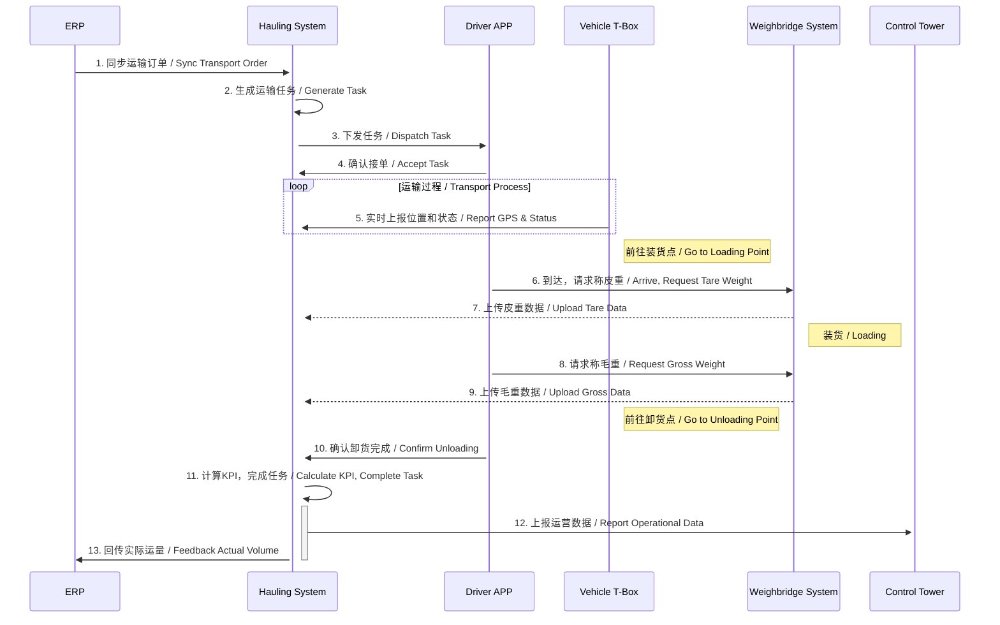
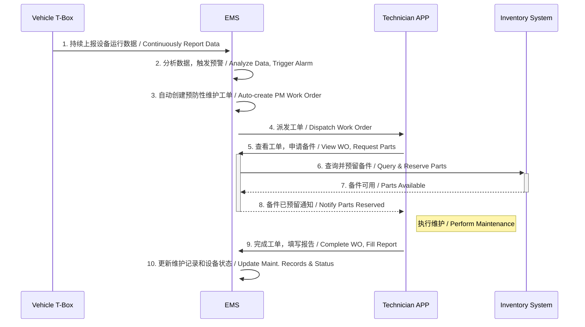

# 数据流转规划 / Data Flow Planning

## 1. 概述 / Overview

数据是MBL数字矿山管控塔解决方案的血液。本章节旨在清晰地定义在不同业务场景下，数据如何在各个系统、模块和层级之间产生、流动、处理和消费，从而确保数据的一致性、及时性和准确性，为上层业务决策提供高质量的支撑。

Data is the lifeblood of the MBL Digital Mine Control Tower solution. This chapter aims to clearly define how data is generated, flows, is processed, and consumed across various systems, modules, and layers in different business scenarios. This ensures data consistency, timeliness, and accuracy, providing high-quality support for upper-level business decisions.

## 2. 核心数据域 / Core Data Domains

整个解决方案的数据可以划分为以下几个核心领域：

The data for the entire solution can be divided into the following core domains:

- **Hauling运营数据 / Hauling Operations Data**: 围绕运输任务产生的数据，如任务、调度、轨迹、称重、效率KPI等。
  Data generated around transportation tasks, such as tasks, schedules, trajectories, weighing data, efficiency KPIs, etc.
- **设备管理数据 / Equipment Management Data**: 围绕设备全生命周期产生的数据，如设备档案、实时工况、维护记录、备件消耗、能耗等。
  Data generated throughout the equipment lifecycle, such as equipment profiles, real-time operating conditions, maintenance records, spare parts consumption, energy consumption, etc.
- **主数据 / Master Data**: 系统运行所需的基础数据，如人员、组织、车辆、物料、地理信息等。
  Basic data required for system operation, such as personnel, organization, vehicles, materials, geographic information, etc.

## 3. 关键业务场景的数据流 / Data Flow in Key Business Scenarios

### 场景一：Hauling运输任务执行 / Scenario 1: Hauling Task Execution

这是最核心的业务场景，数据流贯穿了计划、调度、执行、监控和分析的全过程。

This is the core business scenario, with data flowing through the entire process of planning, scheduling, execution, monitoring, and analysis.

**数据流转说明 / Data Flow Description:**

1.  **计划输入 (ERP -> Hauling系统)**: ERP系统将生产计划或运输订单同步至Hauling系统。
    **Plan Input (ERP -> Hauling System)**: The ERP system syncs production plans or transport orders to the Hauling System.
2.  **任务生成 (Hauling系统)**: Hauling系统根据订单自动或手动创建具体的运输任务。
    **Task Generation (Hauling System)**: The Hauling System automatically or manually creates specific transport tasks based on the orders.
3.  **任务下发与接收 (Hauling系统 -> 司机APP)**: 任务通过系统下发给司机的移动应用（APP），司机接单确认。
    **Task Dispatch & Acceptance (Hauling System -> Driver APP)**: Tasks are dispatched to the driver's mobile app, and the driver accepts the task.
4.  **过程监控 (车辆T-Box -> Hauling系统)**: 车辆上的T-Box持续将GPS位置、速度、油耗等数据上传至Hauling系统，实现实时在途监控。
    **Process Monitoring (Vehicle T-Box -> Hauling System)**: The T-Box on the vehicle continuously uploads data like GPS location, speed, and fuel consumption to the Hauling System for real-time tracking.
5.  **称重数据采集 (地磅系统 -> Hauling系统)**: 车辆经过地磅时，称重数据（皮重、毛重）被采集并发送至Hauling系统，与运输任务关联。
    **Weighing Data Collection (Weighbridge System -> Hauling System)**: When a vehicle passes the weighbridge, weight data (tare, gross) is collected and sent to the Hauling System, linked to the transport task.
6.  **状态更新 (司机APP -> Hauling系统)**: 司机通过APP更新关键节点状态，如"到达装货点"、"装货完成"、"卸货完成"。
    **Status Updates (Driver APP -> Hauling System)**: The driver updates key node statuses via the app, such as "Arrived at Loading Point," "Loading Complete," or "Unloading Complete."
7.  **数据汇总与分析 (Hauling系统 -> 管控塔)**: Hauling系统在任务完成后，计算各项KPI（如周期时间、单车效率等），并将汇总的运营数据上报至管控塔进行宏观展示和分析。
    **Data Aggregation & Analysis (Hauling System -> Control Tower)**: Upon task completion, the Hauling System calculates various KPIs (e.g., cycle time, single-truck efficiency) and reports the aggregated operational data to the Control Tower for macroscopic display and analysis.
8.  **业务闭环 (Hauling系统 -> ERP)**: 实际完成的运量等信息回传至ERP，用于更新订单状态和成本核算。
    **Business Loop Closure (Hauling System -> ERP)**: Information such as the actual completed volume is fed back to the ERP to update order status and for cost accounting.

### 场景二：设备预防性维护 / Scenario 2: Preventive Equipment Maintenance

此场景展示了如何基于设备数据驱动维护流程，实现从被动维修到主动预防的转变。

This scenario demonstrates how to drive the maintenance process based on equipment data, shifting from reactive repairs to proactive prevention.

**数据流转说明 / Data Flow Description:**

1.  **数据采集 (车辆T-Box -> 设备管理系统)**: T-Box持续采集设备的关键参数（如发动机转速、油压、温度、运行时长等）并发送至设备管理系统(EMS)。
    **Data Collection (Vehicle T-Box -> EMS)**: The T-Box continuously collects key equipment parameters (e.g., engine speed, oil pressure, temperature, operating hours) and sends them to the Equipment Management System (EMS).
2.  **数据分析与预警 (设备管理系统)**: EMS后台基于预设的维护策略（如每运行500小时）或预测性维护模型，分析数据并触发维护预警。
    **Data Analysis & Alerting (EMS)**: The EMS backend analyzes the data and triggers a maintenance alert based on preset maintenance strategies (e.g., every 500 operating hours) or predictive models.
3.  **工单生成与派发 (设备管理系统 -> 维护技术员APP)**: 系统自动根据预警生成维护工单，并根据技能和排班情况，将工单派发给合适的维护技术员。
    **Work Order Generation & Dispatch (EMS -> Technician APP)**: The system automatically generates a maintenance work order based on the alert and dispatches it to a suitable technician based on skills and schedules.
4.  **备件协同 (设备管理系统 <-> 库存系统)**: 技术员在执行前，通过工单关联的BOM清单向库存系统查询并申请备件，系统完成库存预留或自动触发采购流程。
    **Spare Parts Coordination (EMS <-> Inventory System)**: Before execution, the technician queries and requests spare parts from the inventory system via the BOM list associated with the work order. The system reserves the stock or automatically triggers a procurement process.
5.  **执行与反馈 (维护技术员APP -> 设备管理系统)**: 技术员在现场通过APP记录工时、消耗的备件，并填写维护报告。完成后，工单状态被更新。
    **Execution & Feedback (Technician APP -> EMS)**: The technician records work hours, consumed parts, and fills out a maintenance report on-site via the app. The work order status is updated upon completion.
6.  **知识沉淀 (设备管理系统)**: 完成的工单和解决方案被存入设备的电子档案和知识库，用于未来的查询和分析，同时更新设备的维护历史和健康状态。
    **Knowledge Accumulation (EMS)**: The completed work order and solution are stored in the equipment's digital profile and the knowledge base for future queries and analysis, while also updating the equipment's maintenance history and health status.

## 4. 数据集成接口汇总 / Summary of Data Integration Interfaces

| 接口名称 / Interface Name | 提供方 / Provider | 消费方 / Consumer | 频率 / Frequency | 协议/方式 / Protocol/Method | 核心数据 / Core Data |
| :--- | :--- | :--- | :--- | :--- | :--- |
| 运输订单接口 / Transport Order API | ERP | Hauling系统 | 实时/定时 / Real-time/Scheduled | API | 订单号, 计划量, 物料, 时间窗口 / Order No., Plan Qty, Material, Time Window |
| 称重数据接口 / Weighing Data API | 地磅系统 | Hauling系统 | 实时 / Real-time | DB/File/API | 车号, 皮重, 毛重, 时间 / Vehicle ID, Tare, Gross, Timestamp |
| 车辆实时数据接口 / Vehicle Real-time Data | 车辆T-Box | Hauling系统, 设备管理系统 | 准实时(秒级) / Near Real-time (sec) | MQTT/TCP | GPS, 速度, 油耗, 状态 / GPS, Speed, Fuel, Status |
| 设备工况数据接口 / Equipment Condition Data | 车辆T-Box | 设备管理系统 | 准实时(秒/分钟) / Near Real-time (sec/min) | MQTT/TCP | 发动机参数, 传感器数据 / Engine Params, Sensor Data |
| 备件库存接口 / Spare Parts Inventory API | 库存系统 | 设备管理系统 | 实时 / Real-time | API | 物料号, 库存量, 库位 / Part No., Qty, Location |
| 管控塔数据上报接口 / CT Data-Feed API | Hauling系统, 设备管理系统 | 管控塔 | 定时(分钟级) / Scheduled (min) | API | 运营KPI, 设备OEE, 告警统计 / Ops KPIs, OEE, Alarm Stats |

