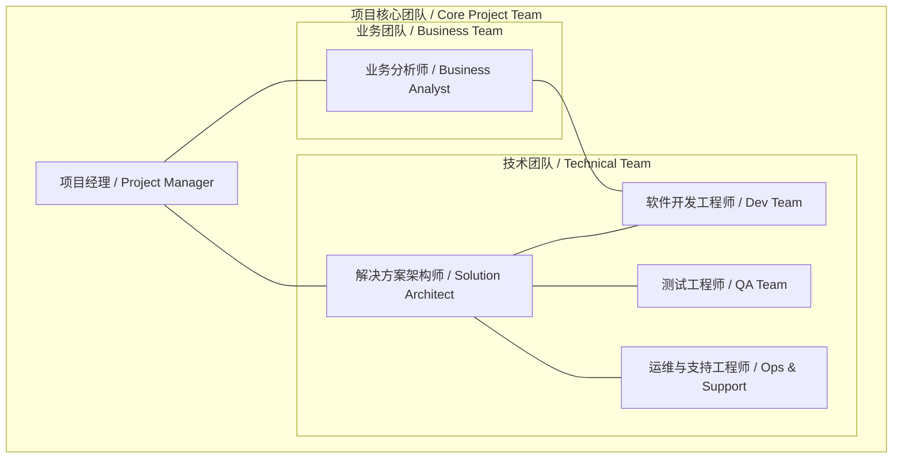

# 6.1 团队资源规划 / Team and Resource Planning

## 1. 引言 / Introduction

为了确保MBL数字矿山管控塔项目的成功交付，一个结构合理、技能全面、沟通顺畅的项目团队至关重要。本计划旨在明确项目所需的角色与职责、团队组织架构、各阶段的人员投入，以及对团队成员的技能要求，从而为项目的顺利实施提供有力的人力资源保障。

To ensure the successful delivery of the MBL Digital Mine Control Tower project, a well-structured project team with comprehensive skills and smooth communication is essential. This plan aims to define the roles and responsibilities, team organizational structure, staffing at each stage, and skill requirements for team members, thereby providing robust human resource assurance for the project's successful implementation.

## 2. 角色与职责 / Roles and Responsibilities

项目团队将由来自客户方和实施方的核心成员组成，共同协作。主要角色及其核心职责如下：

The project team will be composed of core members from both the client and the implementation partner, working in collaboration. The main roles and their core responsibilities are as follows:

| 角色 (中) / Role (CN) | 角色 (英) / Role (EN) | 核心职责 / Core Responsibilities |
| :--- | :--- | :--- |
| **项目经理** | **Project Manager** | - 负责项目整体规划、执行和监控 - 管理项目范围、进度、成本和质量 - 组织和协调团队资源，领导项目会议 - 作为项目对内和对外的主要沟通接口  - Responsible for overall project planning, execution, and monitoring - Manage project scope, schedule, cost, and quality - Organize and coordinate team resources, lead project meetings - Serve as the primary communication interface for the project |
| **业务分析师** | **Business Analyst** | - 深入理解客户业务需求，梳理业务流程 - 将业务需求转化为详细的功能规格 - 负责用户故事编写和需求澄清 - 支持用户验收测试（UAT）  - Deeply understand client business needs and map business processes - Translate business requirements into detailed functional specifications - Responsible for writing user stories and clarifying requirements - Support User Acceptance Testing (UAT) |
| **解决方案架构师** | **Solution Architect** | - 设计系统的整体技术架构和解决方案蓝图 - 确保方案的技术可行性、可扩展性和安全性 - 定义核心技术规范、标准和接口 - 指导开发团队解决关键技术难题  - Design the overall technical architecture and solution blueprint - Ensure technical feasibility, scalability, and security of the solution - Define core technical specifications, standards, and interfaces - Guide the development team in solving key technical challenges |
| **软件开发工程师** | **Software Development Engineer** | - 负责系统各功能模块的编码实现 - 参与详细设计和单元测试 - 遵循编码规范，确保代码质量 - 修复测试过程中发现的缺陷  - Responsible for coding and implementation of system functional modules - Participate in detailed design and unit testing - Adhere to coding standards to ensure code quality - Fix defects found during testing |
| **测试工程师** | **Quality Assurance Engineer** | - 制定测试计划和测试用例 - 执行功能测试、集成测试和性能测试 - 管理和跟踪缺陷生命周期 - 产出测试报告，保障软件质量  - Develop test plans and test cases - Execute functional, integration, and performance testing - Manage and track the defect lifecycle - Produce test reports to ensure software quality |
| **运维与支持工程师** | **Operations & Support Engineer** | - 负责系统的部署、配置和上线 - 监控系统线上运行状态，确保稳定性 - 响应和处理线上问题，提供技术支持 - 管理生产环境和日常运维工作  - Responsible for system deployment, configuration, and go-live - Monitor the online status of the system to ensure stability - Respond to and handle online issues, provide technical support - Manage the production environment and daily operational tasks |

## 3. 团队组织架构 / Team Organizational Structure

## 4. 各阶段资源投入估算 / Staffing Estimation by Phase

项目资源投入将根据不同阶段的工作重心进行动态调整。以下为各关键角色的投入估算（百分比代表该角色在该阶段的全职工作时间投入比例）。

Project resource allocation will be dynamically adjusted based on the focus of work in different phases. Below is an estimation of the effort for key roles (percentage indicates the proportion of full-time work dedicated by the role in that phase).

| 角色 / Role | 阶段一: MVP建设 Phase 1: MVP Build (3-4 月 / Months) | 阶段二: 功能扩展 Phase 2: Functional Expansion (4-6 月 / Months) | 阶段三: AI赋能与持续优化 Phase 3: AI Empowerment & Optimization (持续 / Ongoing) |
| :--- | :---: | :---: | :---: |
| **项目经理** | 100% | 100% | 50% |
| **业务分析师** | 100% | 80% | 30% |
| **解决方案架构师** | 100% | 80% | 50% |
| **软件开发工程师** | 100% | 100% | 80% |
| **测试工程师** | 100% | 100% | 50% |
| **运维与支持工程师** | 50% | 80% | 100% |

**注**: 上述为估算值，具体人员数量和投入比例将根据项目启动后的详细规划进行微调。

**Note**: The above are estimates. The specific number of personnel and their allocation percentages will be fine-tuned based on the detailed planning after project kickoff.

## 5. 技能要求矩阵 / Skill Requirements Matrix

为确保团队成员能够胜任项目工作，需要具备以下关键技能：

To ensure team members are competent for the project work, the following key skills are required:

| 技能领域 / Skill Area | 关键技能描述 / Key Skill Description | 涉及角色 / Relevant Roles |
| :--- | :--- | :--- |
| **项目管理** | - 敏捷/Scrum项目管理经验 - PMP或同等资格认证者优先 - 风险管理、沟通管理能力 | 项目经理 |
| **业务分析** | - 矿业/重工业领域业务流程分析经验 - 熟练使用UML、BPMN等建模工具 - 优秀的需求引导和文档编写能力 | 业务分析师 |
| **架构设计** | - 微服务架构、云原生技术（Docker, K8s） - IoT物联网平台架构经验 - 大数据处理技术（Kafka, Flink, etc.） - 数据库（SQL/NoSQL）设计能力 | 解决方案架构师 |
| **软件开发** | - 精通后端开发语言（如Java/Go/Python） - 精通前端开发框架（如Vue/React） - 熟悉微服务框架（如Spring Cloud） - 熟悉CI/CD流程和工具 | 软件开发工程师 |
| **质量保证** | - 自动化测试框架（Selenium, Appium） - 性能测试工具（JMeter, LoadRunner） - 熟悉缺陷管理流程和工具 | 测试工程师 |
| **系统运维** | - Linux系统管理 - 熟悉云平台（AWS/Azure/阿里云）运维 - 掌握监控工具（Prometheus, Grafana） | 运维与支持工程师 |

通过明确的资源规划，MBL项目旨在打造一支高效、专业、协作的精英团队，为项目的成功奠定坚实的基础。

Through clear resource planning, the MBL project aims to build an efficient, professional, and collaborative elite team, laying a solid foundation for the project's success.
