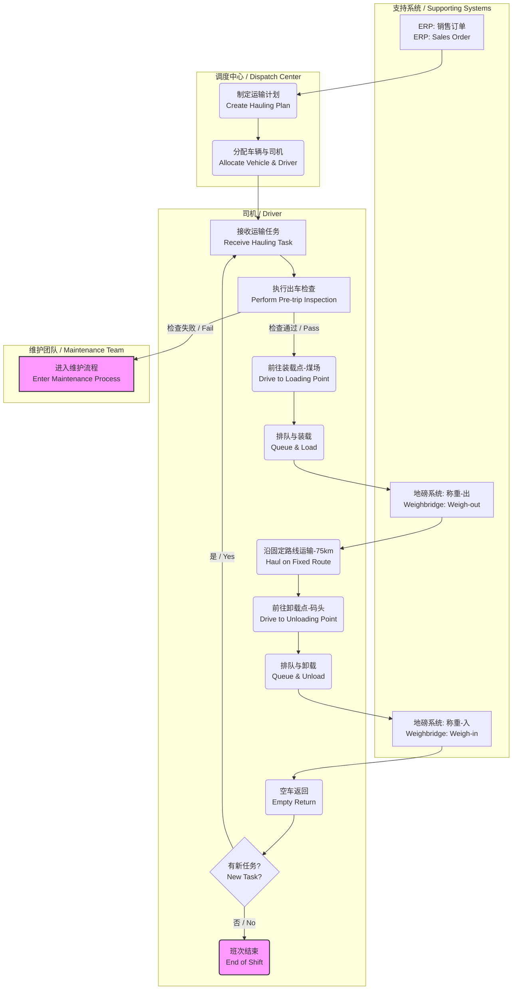

```mermaid
graph TD
    %% Node Definitions
    A[ERP: 销售订单<br>ERP: Sales Order]
    B(制定运输计划<br>Create Hauling Plan)
    C(分配车辆与司机<br>Allocate Vehicle & Driver)
    E[执行出车检查<br>Perform Pre-trip Inspection]
    F[进入维护流程<br>Enter Maintenance Process]
    G[接收运输任务<br>Receive Hauling Task]
    H(前往装载点-煤场<br>Drive to Loading Point)
    I(排队与装载<br>Queue & Load)
    J[地磅系统: 称重-出<br>Weighbridge: Weigh-out]
    K(沿固定路线运输-75km<br>Haul on Fixed Route)
    L(前往卸载点-码头<br>Drive to Unloading Point)
    M(排队与卸载<br>Queue & Unload)
    N[地磅系统: 称重-入<br>Weighbridge: Weigh-in]
    O(空车返回<br>Empty Return)
    P{有新任务?<br>New Task?}
    Q(班次结束<br>End of Shift)

    %% Subgraph Grouping
    subgraph "调度中心 / Dispatch Center"
        B
        C
    end

    subgraph "司机 / Driver"
        E
        G
        H
        I
        K
        L
        M
        O
        P
        Q
    end

    subgraph "支持系统 / Supporting Systems"
        A
        J
        N
    end

    subgraph "维护团队 / Maintenance Team"
        F
    end

    %% Connections
    A --> B
    B --> C
    C --> G
    G --> E
    E -- "检查通过 / Pass" --> H
    E -- "检查失败 / Fail" --> F
    H --> I
    I --> J
    J --> K
    K --> L
    L --> M
    M --> N
    N --> O
    O --> P
    P -- "是 / Yes" --> G
    P -- "否 / No" --> Q

    %% Styling
    style F fill:#f9f,stroke:#333,stroke-width:2px
    style Q fill:#f9f,stroke:#333,stroke-width:2px
``` 